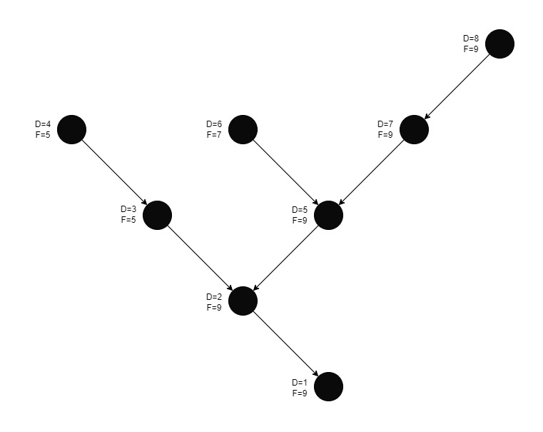

# Global Hydrography

Scripts to explore and process global hydrography (stream lines and basin boundaries) for Model My Watershed.

TDX-Hydro is the best available global hydrographic datasuite, first released to the public in summer of 2023 by the [US National Geospatial-Intelligence Agency (NGA)](https://www.nga.mil) in collaboration with USACE ERDC and NASA, and derived from the 12 m resolution TanDEM-X elevation data.

- Carlson et al. 2024. TDX-Hydro: Global High-Resolution Hydrography Derived from TanDEM-X. *ESS Open Archive*. DOI: [10.22541/essoar.171629686.65893579/v1](https://doi.org/10.22541/essoar.171629686.65893579/v1).  
- McCormack et al. 2022. [Validation of TDX-Hydro; a global, TanDEM-X derived, 12m resolution hydrographic data suite](https://agu.confex.com/agu/fm22/meetingapp.cgi/Paper/1119749). AGU Abstract. 
- Data and technical documentation are downloadable from the NGA Office for Geomatics website, https://earth-info.nga.mil/, under the "Geosciences" tab.

The [GEOGlOWS ECMWF Streamflow Model](https://geoglows.ecmwf.int/) project built their [v2.0 release](https://data.geoglows.org/geoglows-2-0) around a [modified version of TDX-Hydro](https://data.geoglows.org/dataset-descriptions/gis-streams-and-catchments) with added attributes (i.e. topological order) and slightly simplified headwater streamlines for improved modeling and mapping. The [GEOGLOWS v2 Data Guide](https://data.geoglows.org) provides useful information and tutorials relevant to using TDX-Hydro data.

TDX-Hydro was built around [HydroSHEDS v1 HydroBASINS](https://www.hydrosheds.org/products/hydrobasins) Level 2 boundaries (continental sub-units). [HydroSHEDS v2](https://www.hydrosheds.org/hydrosheds-v2) will be developed from the same TanDEM-X elevation data used by TDX-Hydro.


## Demonstration for AWSMOD1 Task 5: Add Global Watershed Shapes

Project Objectives: Develop [Model My Watershed](https://modelmywatershed.org) hydrographic capabxilities over most of the world to:

- Display river network “bluelines” (polylines), with zoom-dependent rendering by reach size.
- Display drainage basin boundaries (polygons) for multiple levels of sub-basins, with zoom-dependent enabling of different levels.
- Delineate upstream watershed boundary, rapidly, from any lat/lon.

UPDATE: Model My Watershed [release 1.36.0](https://github.com/WikiWatershed/model-my-watershed/releases/tag/1.36.0) introduced:

- Global Stream Reach Analysis and Visualization of TDX-Hydro stream network bluelines.  
- Global Rapid Watershed Delineation from TDX Hydro streamreach basin polygons, using the Modified Nested Set Index (MNSI) algorithm based on the work of [Haag and Shokoufandeh (2019)](https://doi.org/10.1016/j.envsoft.2017.06.009), as described below.

## Get Started
This repo is still under development and has not yet been packaged for widespread use.

### Install Development Environment with Conda

Follow these steps to install using the [conda](https://docs.conda.io/en/latest/) package manager.

#### 1. Install Miniconda or Anaconda Distribution

We recommend installing the light-weight [Miniconda](https://docs.conda.io/projects/miniconda/en/latest/) that includes Python, the [conda](https://conda.io/docs/) environment and package management system, and their dependencies.

If you have already installed the [**Anaconda Distribution**](https://www.anaconda.com/download), you can use it to complete the next steps, but you may need to [update to the latest version](https://docs.anaconda.com/free/anaconda/install/update-version/).

#### 2. Clone or Download this Repository

From this Github page, click on the green "Code" dropdown button near the upper right. Select to either "Open in GitHub Desktop" (i.e. git clone) or "Download ZIP". We recommend using GitHub Desktop, to most easily receive updates.

Place your copy of this repo in any convenient location on your computer.

#### 3. Create a Conda Environment for this Repository

We recommend creating a custom virtual environment with the same software dependencies that we've used in development and testing, as listed in the [`environment.yml`](environment.yml) file. 

Create a project-specific environment using this [conda](https://conda.io/docs/) command in your terminal or Anaconda Prompt console. If necessary, replace `environment.yml` with the full file pathway to the `environment.yml` file in the local cloned repository.

```shell
conda env create --file environment.yml
```

Alternatively, use the faster [`libmamba` solver](https://conda.github.io/conda-libmamba-solver/getting-started/) with:

```shell
conda env create -f environment.yml --solver=libmamba
```

Activate the environment using the instructions printed by conda after the environment is created successfully.

To update your environment run the following command:  

```shell
conda env update -f environment.yml --solver=libmamba --prune 
```


#### 4. Add your Repo's Path to Miniconda site-packages

To have access to this repository's modules in your Python environments, it is necessary to save the path to your copy of this repo in Miniconda's or Anaconda's `conda.pth` file in the environment's `site-packages` directory (i.e. something like `<$HOME>/anaconda/lib/pythonX.X/site-packages/conda.pth` or `<$HOME>/miniconda3/envs/drwi_pa/lib/python3.11/site-packages/conda.pth` or similar), where `<$HOME>` refers to the full path of the user directory, such as `/home/username` on Linux/Mac.

- The easiest way to do this is to use the [conda develop](https://docs.conda.io/projects/conda-build/en/latest/resources/commands/conda-develop.html) command in the console or terminal like this, replacing `/path/to/module/` with the full file pathway to the local cloned HSPsquared repository:

    ```console
    conda develop /path/to/module/
    ```

You should now be able to run the examples and create your own Jupyter Notebooks!

# Modified Nested Set Index

# How to Use the Modified Nested Set Index Results 
The repository provides an implementation of a modified nested set index algorithm based on the work of [Haag and Shokoufandeh (2019)](https://doi.org/10.1016/j.envsoft.2017.06.009). This algorithm is a modified depth-first search algorithm that visits each node twice; recording both the discover time (number of steps to visit the node once) and the finish time (number of steps to visit the node a second time). The discover and finish time values provide a method to select all upstream elements on a target node by selected nodes where the `discovery time >= target discover time` and the `finish time <= target finish time`.

## Example application
Consider the following graph representing a watershed, for which the modified nested set algorithm has been applied. The discover time (d) and finish time (f) values are reported next to the nodes. 


If we wanted to select the upstream elements for the node boxed in red, we can use the discover and finish time values. The elements in blue satisfy the conditions `d>=5` (with 5 being the d value from the selected node) and `f<=9` (with 9 being the f value of the selected node).

